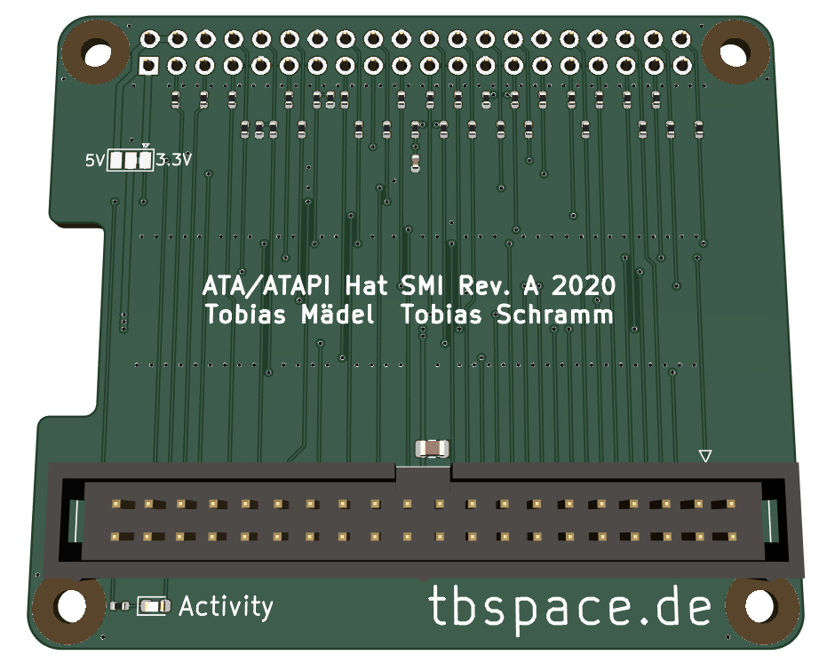

ATAPIHat-SMI
=============================

### Overview

This is an experimental adapter PCB for the pata-gpio driver.  
The pinout was chosen deliberately to support faster SMI and BCM2835 register modes,  
which are not yet supported in the kernel driver. 

Rev.A testboards were ordered but not tested yet. **Proceed at your own risk.** 

### Manufacturing

Manufacturing files for JLCs automatic assembly service can be found at `gerbers/RevA/ATAPIHat-SMI/`.  
5 adapter boards cost ~15$ (incl. components). 

### Additional info 

[Schematic](gerbers/RevA/ATAPIHat-SMI/ATAPIHat-SMI.pdf)  
[Interactive BOM](https://tbspace.de/content/downloads/atapihat-smi-ibom-reva.html)  
[Bitbanged-GPIO Kernel driver](https://github.com/Manawyrm/pata-gpio)  

### Credits
The PCB layout was done by [@Toble_Miner](https://github.com/TobleMiner)! Thanks!
